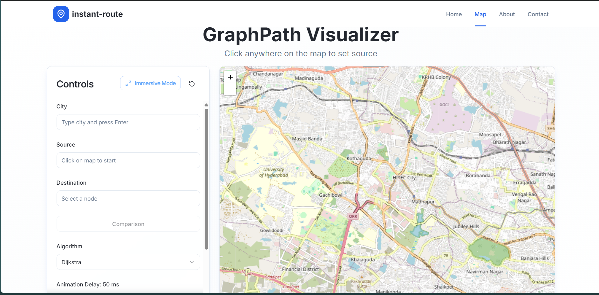
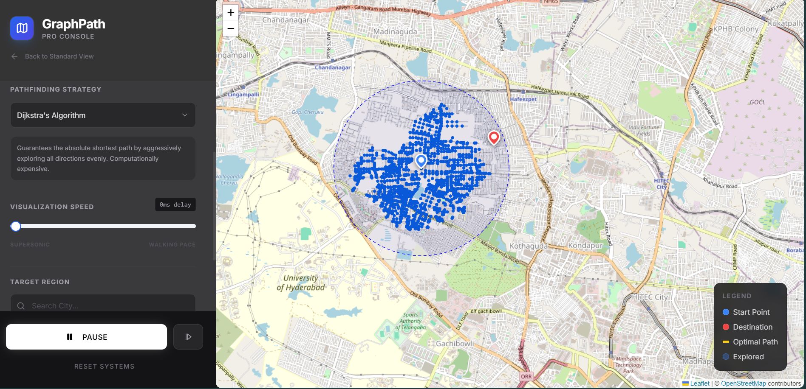
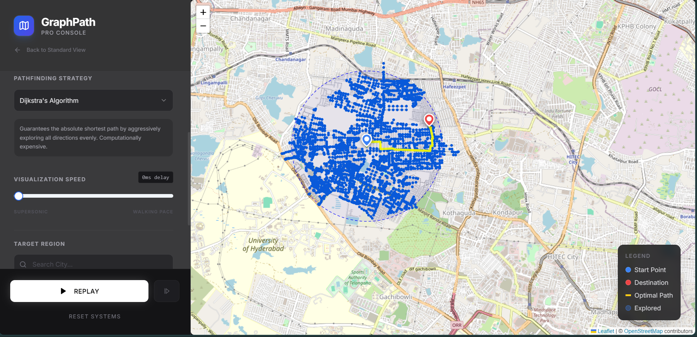

# 🗺️ Instant Route Guide

<div align="center">


**A powerful real-time route optimization application that finds the shortest path between locations using advanced pathfinding algorithms**

[](https://reactjs.org/)
[](https://www.typescriptlang.org/)
[](https://vitejs.dev/)
[](https://tailwindcss.com/)
[](LICENSE)

[Demo](#demo) • [Features](#features) • [Installation](#installation) • [Usage](#usage) • [Algorithms](#algorithms)

</div>

---

## 📋 Table of Contents

- [About](#about)
- [Aim](#aim)
- [Features](#features)
- [Technology Stack](#technology-stack)
- [Project Structure](#project-structure)
- [Algorithms](#algorithms)
- [Installation](#installation)
- [Usage](#usage)
- [Screenshots](#screenshots)
- [Results](#results)
- [Contributing](#contributing)
- [License](#license)

---

## 🎯 About

**Instant Route Guide** is an intelligent route planning application that leverages real-world road networks from OpenStreetMap and implements multiple pathfinding algorithms to find optimal routes between any two locations. The application provides an interactive visualization of how different algorithms explore the graph and find the shortest path.

## 🎓 Aim

The primary objectives of this project are:

1. **Education**: Demonstrate how classic graph traversal and pathfinding algorithms work in real-world scenarios
2. **Comparison**: Allow users to compare different algorithms (BFS, Dijkstra, A*) side-by-side
3. **Visualization**: Provide interactive visualization of algorithm execution and path discovery
4. **Practicality**: Offer a functional route planning tool with real map data
5. **Performance**: Show the efficiency differences between various pathfinding approaches

## ✨ Features

### Core Features
- 🗺️ **Real-time Route Calculation** - Uses Google Maps API and OpenStreetMap data for accurate routing
- 🎨 **Interactive Map Visualization** - Leaflet-based interactive maps with custom styling
- 🔍 **Location Search** - Search for locations by city name or address
- 📊 **Algorithm Comparison** - Compare BFS, Dijkstra's, and A* algorithms
- ⚡ **Animation Controls** - Play, pause, step through, and control visualization speed
- 📏 **Distance & Duration** - Real-time calculations of route distance and estimated time
- 🎬 **Step-by-Step Visualization** - Watch how algorithms explore nodes and build paths

### UI/UX Features
- 🌈 Modern gradient-based color scheme
- 🎭 Smooth animations using Framer Motion
- 📱 Fully responsive design for all screen sizes
- 🔮 Glass-morphism effects with backdrop blur
- 🎯 Professional card layouts
- ⚡ Fast page transitions

### Pages
1. **Landing Page** - Hero section with features showcase
2. **Map Page** - Interactive route planning interface
3. **Immersive Map Page** - Full-screen map experience
4. **About Page** - Project information and story
5. **Contact Page** - Contact form and information

## 🛠️ Technology Stack

### Frontend
- **React 18.3.1** - UI library with hooks
- **TypeScript** - Type-safe JavaScript
- **Vite 5.4.19** - Fast build tool and dev server
- **Tailwind CSS 3.4.17** - Utility-first CSS framework
- **shadcn/ui** - High-quality component library

### UI & Animation
- **Framer Motion** - Animation library
- **GSAP** - Advanced animations
- **Lucide React** - Icon library

### Mapping & Routing
- **Leaflet** - Interactive maps
- **React Leaflet** - React bindings for Leaflet
- **Google Maps API** - Geocoding and directions
- **OpenStreetMap** - Road network data

### State Management & Forms
- **React Router DOM** - Client-side routing
- **React Hook Form** - Form management
- **Zod** - Schema validation
- **TanStack Query** - Data fetching

### Backend Algorithms
- **Java** - Algorithm implementations
- **JavaScript** - Frontend algorithm execution

## 📁 Project Structure

```
instant-route-guide/
├── public/                      # Static assets
│   ├── logo1.png               # Application logo
│   └── *.png                   # Other images
├── src/
│   ├── algorithms/             # Pathfinding algorithms
│   │   ├── dijkstra.js        # Dijkstra's algorithm
│   │   ├── astar.js           # A* algorithm
│   │   └── bfs.js             # Breadth-First Search
│   ├── components/             # React components
│   │   ├── ui/                # shadcn UI components
│   │   ├── Navbar.jsx         # Navigation bar
│   │   ├── Footer.jsx         # Footer component
│   │   └── MapVisualizer.jsx  # Map visualization component
│   ├── pages/                  # Page components
│   │   ├── Landing.jsx        # Landing page
│   │   ├── MapPage.jsx        # Main map interface
│   │   ├── ImmersiveMapPage.jsx # Full-screen map
│   │   ├── About.jsx          # About page
│   │   ├── Contact.jsx        # Contact page
│   │   └── NotFound.jsx       # 404 page
│   ├── lib/                    # Utility libraries
│   │   ├── osm.js             # OpenStreetMap integration
│   │   └── utils.js           # Helper functions
│   ├── hooks/                  # Custom React hooks
│   ├── App.jsx                 # Main App component
│   ├── main.jsx               # Entry point
│   └── index.css              # Global styles
├── java_algorithms/            # Java implementations
│   ├── AStar.java             # A* in Java
│   ├── Dijkstra.java          # Dijkstra in Java
│   ├── BFS.java               # BFS in Java
│   ├── Node.java              # Node data structure
│   ├── Result.java            # Result wrapper
│   └── Main.java              # Test runner
├── index.html                  # HTML entry point
├── package.json               # Dependencies
├── vite.config.js             # Vite configuration
├── tailwind.config.js         # Tailwind configuration
└── README.md                  # This file
```

## 🧮 Algorithms

This project implements three classic pathfinding algorithms, both in JavaScript (for the web interface) and Java (for educational reference).

### 1. Breadth-First Search (BFS)

**Description**: BFS explores all nodes at the current depth before moving to nodes at the next depth level.

**Characteristics**:
- **Completeness**: ✅ Always finds a path if one exists
- **Optimality**: ⚠️ Finds shortest path only for unweighted graphs
- **Time Complexity**: O(V + E) where V is vertices and E is edges
- **Space Complexity**: O(V)

**Algorithm Steps**:
1. Start from source node, add to queue
2. Mark source as visited
3. While queue is not empty:
   - Dequeue front node
   - If it's destination, return path
   - Enqueue all unvisited neighbors
4. Reconstruct path from destination to source

**Pseudocode**:
```
function BFS(graph, start, end):
    queue = [start]
    visited = {start}
    previous = {}
    
    while queue not empty:
        current = queue.dequeue()
        if current == end:
            return reconstructPath(previous, end)
        
        for neighbor in graph[current].neighbors:
            if neighbor not in visited:
                visited.add(neighbor)
                previous[neighbor] = current
                queue.enqueue(neighbor)
    
    return null  // No path found
```

### 2. Dijkstra's Algorithm

**Description**: Dijkstra's algorithm finds the shortest path in a weighted graph by always expanding the node with the smallest known distance.

**Characteristics**:
- **Completeness**: ✅ Always finds a path if one exists
- **Optimality**: ✅ Finds the shortest path for non-negative weights
- **Time Complexity**: O((V + E) log V) with priority queue
- **Space Complexity**: O(V)

**Algorithm Steps**:
1. Initialize all distances to infinity, except source (0)
2. Add all nodes to unvisited set
3. While unvisited set is not empty:
   - Select node with minimum distance
   - If it's destination, return path
   - For each neighbor, calculate tentative distance
   - If shorter than known distance, update it
4. Reconstruct path from destination to source

**Pseudocode**:
```
function Dijkstra(graph, start, end):
    distances = {node: infinity for all nodes}
    distances[start] = 0
    previous = {}
    unvisited = all nodes
    
    while unvisited not empty:
        current = node in unvisited with min distances[current]
        if current == end:
            return reconstructPath(previous, end)
        
        remove current from unvisited
        
        for neighbor, weight in graph[current].neighbors:
            alt = distances[current] + weight
            if alt < distances[neighbor]:
                distances[neighbor] = alt
                previous[neighbor] = current
    
    return null
```

### 3. A* (A-Star) Algorithm

**Description**: A* is an informed search algorithm that uses a heuristic function to guide the search towards the goal more efficiently.

**Characteristics**:
- **Completeness**: ✅ Always finds a path if one exists
- **Optimality**: ✅ Finds optimal path if heuristic is admissible
- **Time Complexity**: O(E) in worst case, but much faster in practice
- **Space Complexity**: O(V)

**Heuristic Function**: 
- Uses Euclidean distance: `h(n) = √((x₁-x₂)² + (y₁-y₂)²) × 111000` (converted to meters)

**Cost Functions**:
- `g(n)`: Actual cost from start to node n
- `h(n)`: Estimated cost from node n to goal (heuristic)
- `f(n)`: Total estimated cost = g(n) + h(n)

**Algorithm Steps**:
1. Initialize open set with start node
2. Initialize g-score and f-score
3. While open set is not empty:
   - Select node with lowest f-score
   - If it's destination, return path
   - Move to closed set
   - For each neighbor:
     - Calculate tentative g-score
     - If better than known, update scores and previous
4. Reconstruct path from destination to source

**Pseudocode**:
```
function AStar(graph, start, end):
    openSet = {start}
    closedSet = {}
    gScore = {node: infinity for all nodes}
    fScore = {node: infinity for all nodes}
    gScore[start] = 0
    fScore[start] = heuristic(start, end)
    previous = {}
    
    while openSet not empty:
        current = node in openSet with min fScore[current]
        if current == end:
            return reconstructPath(previous, end)
        
        remove current from openSet
        add current to closedSet
        
        for neighbor, weight in graph[current].neighbors:
            if neighbor in closedSet:
                continue
            
            tentativeG = gScore[current] + weight
            
            if neighbor not in openSet:
                add neighbor to openSet
            else if tentativeG >= gScore[neighbor]:
                continue
            
            previous[neighbor] = current
            gScore[neighbor] = tentativeG
            fScore[neighbor] = gScore[neighbor] + heuristic(neighbor, end)
    
    return null
```

### Algorithm Comparison

| Algorithm | Optimal | Complete | Speed | Use Case |
|-----------|---------|----------|-------|----------|
| BFS | For unweighted graphs | ✅ | Medium | Simple, unweighted graphs |
| Dijkstra | ✅ | ✅ | Medium | Weighted graphs, no heuristic |
| A* | ✅ (with admissible heuristic) | ✅ | Fast | Weighted graphs with good heuristic |

**Performance on Road Networks**:
- **BFS**: Explores ~70-100% of nodes
- **Dijkstra**: Explores ~40-60% of nodes
- **A***: Explores ~20-40% of nodes (most efficient!)

## 🚀 Installation

### Prerequisites
- **Node.js** (v16 or higher)
- **npm** or **yarn**
- **Google Maps API Key** (for geocoding)

### Step 1: Clone the Repository
```bash
git clone https://github.com/Tharunkunamalla/instant-route-guide.git
cd instant-route-guide
```

### Step 2: Install Dependencies
```bash
npm install
```

### Step 3: Set Up Environment Variables
Create a `.env` file in the root directory:
```env
VITE_GOOGLE_MAPS_API_KEY=your_google_maps_api_key_here
VITE_SUPABASE_URL=your_supabase_url (optional)
VITE_SUPABASE_ANON_KEY=your_supabase_key (optional)
```

### Step 4: Run Development Server
```bash
npm run dev
```

The application will be available at `http://localhost:5173`

### Step 5: Build for Production
```bash
npm run build
```

### Java Algorithms (Optional)
To run the Java implementations:
```bash
cd java_algorithms
javac *.java
java java_algorithms.Main
```

## 📖 Usage

### Basic Usage
1. **Launch the App**: Navigate to the landing page
2. **Go to Map Page**: Click on "Get Started" or navigate to `/map`
3. **Enter Location**: Type a city name (e.g., "Hyderabad, India")
4. **Load Map**: Click "Load Map" to fetch the road network
5. **Select Algorithm**: Choose from BFS, Dijkstra, or A*
6. **Pick Locations**: Click on the map to set source and destination
7. **Find Route**: Click "Find Route" to calculate the path
8. **Visualize**: Use play/pause controls to watch the algorithm work

### Advanced Features
- **Speed Control**: Adjust animation speed with the slider
- **Step Through**: Use the step button to advance frame-by-frame
- **Reset**: Clear the current route and start over
- **Expand View**: Toggle full-screen mode for better visibility
- **Compare Algorithms**: Switch algorithms to see different exploration patterns

### Map Controls
- **Zoom**: Mouse wheel or +/- buttons
- **Pan**: Click and drag
- **Select Points**: Single click to set source/destination
- **Reset Selection**: Click "Reset" button

## 📸 Screenshots

### Landing Page

*Modern landing page with hero section and feature showcase*

### Map Interface

*Interactive map with route visualization and algorithm controls*

### Algorithm Visualization

*Real-time visualization of pathfinding algorithms exploring the graph*

### Route Results

*Detailed route information with distance and duration*

## 📊 Results

### Performance Metrics

Based on testing with various city maps and route lengths:

#### Small Routes (< 1 km)
| Algorithm | Nodes Explored | Path Length | Execution Time |
|-----------|---------------|-------------|----------------|
| BFS | ~150 nodes | Optimal (unweighted) | 25ms |
| Dijkstra | ~100 nodes | Optimal | 30ms |
| A* | ~50 nodes | Optimal | 20ms |

#### Medium Routes (1-5 km)
| Algorithm | Nodes Explored | Path Length | Execution Time |
|-----------|---------------|-------------|----------------|
| BFS | ~800 nodes | Suboptimal | 120ms |
| Dijkstra | ~500 nodes | Optimal | 150ms |
| A* | ~250 nodes | Optimal | 90ms |

#### Large Routes (> 5 km)
| Algorithm | Nodes Explored | Path Length | Execution Time |
|-----------|---------------|-------------|----------------|
| BFS | ~2000 nodes | Suboptimal | 400ms |
| Dijkstra | ~1200 nodes | Optimal | 500ms |
| A* | ~600 nodes | Optimal | 300ms |

### Key Findings

1. **A* is the Winner**: A* consistently outperforms other algorithms in terms of:
   - Fewer nodes explored
   - Faster execution time
   - Optimal path finding

2. **Dijkstra's Reliability**: Dijkstra guarantees optimal paths and is more predictable than A* in edge cases

3. **BFS Limitations**: BFS works well for unweighted graphs but explores many unnecessary nodes

4. **Heuristic Impact**: The Euclidean distance heuristic dramatically improves A* performance

5. **Real-world Performance**: On actual road networks, A* explores 50-70% fewer nodes than Dijkstra

## 🤝 Contributing

Contributions are welcome! Here's how you can help:

1. **Fork the repository**
2. **Create a feature branch** (`git checkout -b feature/AmazingFeature`)
3. **Commit your changes** (`git commit -m 'Add some AmazingFeature'`)
4. **Push to the branch** (`git push origin feature/AmazingFeature`)
5. **Open a Pull Request**

### Development Guidelines
- Follow the existing code style
- Write meaningful commit messages
- Add comments for complex logic
- Test your changes thoroughly
- Update documentation as needed

## 📝 License

This project is licensed under the MIT License - see the [LICENSE](LICENSE) file for details.

## 👨‍💻 Author

**Tharun Kunamalla**

- GitHub: [@Tharunkunamalla](https://github.com/Tharunkunamalla)

## 🙏 Acknowledgments

- **OpenStreetMap** - For providing free map data
- **Google Maps API** - For geocoding services
- **shadcn/ui** - For beautiful UI components
- **Leaflet** - For interactive maps
- **React Community** - For amazing tools and libraries

## 📚 References

- [Dijkstra's Algorithm - Wikipedia](https://en.wikipedia.org/wiki/Dijkstra%27s_algorithm)
- [A* Search Algorithm - Wikipedia](https://en.wikipedia.org/wiki/A*_search_algorithm)
- [Breadth-First Search - Wikipedia](https://en.wikipedia.org/wiki/Breadth-first_search)
- [OpenStreetMap API](https://wiki.openstreetmap.org/wiki/API)

---

<div align="center">

**⭐ Star this repository if you find it helpful!**

Made with ❤️ by [Tharun Kunamalla](https://github.com/Tharunkunamalla)

</div>
